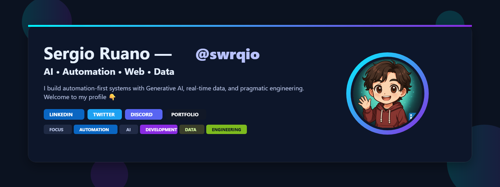

  

  

## 🧬 About Me  
Hi! I’m **Sergio**, a developer passionate about creating intelligent systems that blend **automation, AI, and data** to simplify complexity.  
Currently focused on **Process Automation**, **Generative AI**, and **Web Development**, I’m building tools that help businesses run smarter, faster, and autonomously.

<!-- Projects -->
<h2 style="margin:18px 0 8px; color:#ffffff;">🚀 Current Projects</h2>
<ul style="margin:0 0 16px 18px;">
  <li><b>Process Automation Bot</b> — Ingests and synchronizes data across enterprise systems.</li>
  <li><b>Idealista Chat Automizer</b> — AI-powered messaging agent for real estate automation.</li>
  <li><b>Revolut Business Integrator</b> — Real-time B2B payment system for instant transactions.</li>
  <li><b>Generative AI Agents</b> — Personal AI agents that understand, generate, and assist in real time.</li>
</ul>

<!-- Currently Learning -->
<h2 style="margin:18px 0 8px; color:#ffffff;">🧠 Currently Learning</h2>

<b>Certificate in Generative AI</b> @ <i>The Bridge</i>

<ul style="margin:0 0 16px 18px;">
  <li><b>ReactJS</b> & <b>TypeScript</b> for next-gen web interfaces</li>
  <li><b>Generative AI for Intelligent Automation</b></li>
  <li><b>Machine Learning</b> foundations & applied modeling</li>
  <li><b>Team Building</b> and <b>Project Management</b> in collaborative environments</li>
</ul>

<i>For fun:</i> exploring <b>LUA</b> for backend game development.

## 🧾 What i am learning currently for work / fun

  
  
  

<!-- Tech Stack -->
<h2 style="margin:18px 0 8px; color:#ffffff;">🛠️ Tech Stack</h2>

  
<b>Languages & Web:</b> HTML · CSS · JavaScript · Python

  
<b>Databases:</b> MySQL · SQL Server · PostgreSQL · MongoDB

  
<b>Frameworks & Tools:</b> FastAPI · Flask · React · Node.js

  
<b>Data & Automation:</b> Process Automation · Data Engineering · Debugging · Generative AI

  
<b>Project & DevOps:</b> GitHub · Docker · Linux · VS Code

<!-- Tech badges -->

  
  
  
  
  
  
  
  
  

<!-- GitHub Stats -->
<h2 style="margin:18px 0 8px; color:#ffffff;">⚙️ GitHub Stats</h2>

  
  

<!-- Philosophy -->
<h2 style="margin:18px 0 8px; color:#ffffff;">⚡ Philosophy</h2>
<blockquote style="margin:0 0 24px; padding:12px 16px; border-left:4px solid #8A2BE2; background:#0f141b;">
  “Technology should make work invisible — so people can focus on what truly matters.”
</blockquote>

<!-- Footer -->

  
<b>Let's change the world — one intelligent system at a time.</b> 🌍✨

  
🤖 <b>Tinstra</b> — coming soon…

